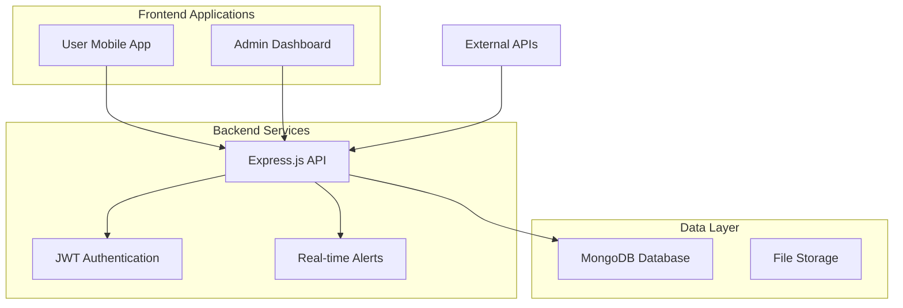

# 🌊 SafeZone - Disaster Management System

<div align="center">


**A comprehensive disaster management platform with real-time alerts, emergency response, and administrative tools**

[](https://nodejs.org/)
[](https://reactjs.org/)
[](https://www.typescriptlang.org/)
[](https://www.mongodb.com/)
[](https://developer.mozilla.org/en-US/docs/Web/Progressive_web_apps)

</div>

## 📋 Table of Contents

- [🌟 Features](#-features)
- [🏗️ Architecture](#-architecture)
- [🚀 Quick Start](#-quick-start)
- [📱 Applications](#-applications)
- [🛠️ Technology Stack](#-technology-stack)
- [📊 Project Structure](#-project-structure)
- [🔐 Security](#-security)
- [📖 API Documentation](#-api-documentation)
- [🤝 Contributing](#-contributing)
- [📄 License](#-license)

## 🌟 Features

### 🚨 Real-Time Disaster Management
- **Live Disaster Alerts**: Instant notifications for nearby disasters
- **Location-Based Tracking**: GPS-powered proximity detection
- **Progressive Web App**: Works offline with service worker support
- **Audio Alert System**: Critical emergency sound notifications
- **Multi-Language Support**: Accessible disaster information

### 👥 User Features
- **Emergency SOS**: One-tap emergency assistance
- **Safe Route Navigation**: AI-powered safe path recommendations
- **Status Reporting**: "I'm Safe" / "Need Help" status updates
- **Resource Center**: Emergency supplies and shelter information
- **Offline Functionality**: Critical features work without internet

### 🏛️ Administrative Tools
- **Comprehensive Dashboard**: Real-time system monitoring
- **Disaster Management**: Create, update, and manage disaster events
- **User Management**: Monitor and assist registered users
- **Volunteer Coordination**: Manage emergency response teams
- **System Analytics**: Data-driven insights and reporting
- **Danger Zone Operations**: Critical system maintenance tools

## 🏗️ Architecture

<div align="center">


</div>

### System Components



## 🚀 Quick Start

### Prerequisites
- **Node.js** (v16 or higher)
- **MongoDB** (v4.4 or higher)
- **Git**

### 🔧 Installation

1. **Clone the repository**
   ```bash
   git clone https://github.com/yourusername/safezone-disaster-management.git
   cd safezone-disaster-management
   ```

2. **Setup Backend**
   ```bash
   cd backend
   npm install
   cp config/config.env.example config/config.env
   # Edit config.env with your database credentials
   npm run dev
   ```

3. **Setup User Application**
   ```bash
   cd ../user
   npm install
   npm run dev
   ```

4. **Setup Admin Dashboard**
   ```bash
   cd ../admin
   npm install
   npm run dev
   ```

### 🌐 Access Applications

| Application | URL | Purpose |
|-------------|-----|---------|
| **User App** | http://localhost:5173 | End-user disaster alerts and safety features |
| **Admin Dashboard** | http://localhost:5174 | Administrative management and monitoring |
| **Backend API** | http://localhost:4000 | RESTful API endpoints |

## 📱 Applications

### 1. 👤 User Application (`/user`)

<div align="center">


</div>

**Key Features:**
- 🚨 Real-time disaster alerts
- 📍 Location-based emergency detection  
- 🔊 Audio emergency notifications
- 📱 Progressive Web App (PWA)
- 🗺️ Interactive emergency maps
- 📞 Emergency contacts integration

**Tech Stack:** React, Vite, Tailwind CSS, Framer Motion, Service Workers

### 2. 🏛️ Admin Dashboard (`/admin`)

<div align="center">


</div>

**Key Features:**
- 📊 Real-time system analytics
- 🌍 Interactive disaster mapping
- 👥 User and volunteer management
- ⚠️ Disaster creation and monitoring
- 🔒 System danger zone operations
- 📈 Performance monitoring

**Tech Stack:** React, TypeScript, Tailwind CSS, Shadcn/UI, React Query

### 3. 🖥️ Backend API (`/backend`)

<div align="center">


</div>

**Key Features:**
- 🔐 JWT-based authentication
- 📍 Geolocation services
- 🚨 Real-time alert system
- 📊 Analytics and reporting
- 🗄️ MongoDB data management
- ⚡ High-performance endpoints

**Tech Stack:** Node.js, Express.js, MongoDB, JWT, Bcrypt

## 🛠️ Technology Stack

### Frontend Technologies
| Technology | Purpose | Version |
|------------|---------|---------|
| **React** | UI Framework | ^18.3.1 |
| **TypeScript** | Type Safety | ^5.8.3 |
| **Tailwind CSS** | Styling | ^4.1.13 |
| **Framer Motion** | Animations | ^11.18.2 |
| **React Router** | Navigation | ^6.30.1 |
| **Vite** | Build Tool | ^7.1.2 |

### Backend Technologies
| Technology | Purpose | Version |
|------------|---------|---------|
| **Node.js** | Runtime | ^16.0.0 |
| **Express.js** | Web Framework | ^4.19.2 |
| **MongoDB** | Database | ^8.6.0 |
| **JWT** | Authentication | ^9.0.2 |
| **Bcrypt** | Password Hashing | ^5.1.1 |

### Additional Tools
- **Leaflet** - Interactive maps
- **Service Workers** - PWA functionality
- **Radix UI** - Accessible components
- **Lucide React** - Icon system

## 📊 Project Structure

```
safezone-disaster-management/
├── 📁 backend/                 # Node.js API Server
│   ├── 📁 controllers/         # Route controllers
│   ├── 📁 middleware/          # Custom middleware
│   ├── 📁 models/              # MongoDB schemas
│   ├── 📁 routes/              # API routes
│   ├── 📁 config/              # Configuration files
│   └── 📄 server.js            # Main server file
│
├── 📁 user/                    # React User Application
│   ├── 📁 src/
│   │   ├── 📁 components/      # React components
│   │   ├── 📁 pages/           # Application pages
│   │   ├── 📁 hooks/           # Custom hooks
│   │   ├── 📁 utils/           # Utility functions
│   │   └── 📁 assets/          # Static assets
│   └── 📁 public/              # Public assets
│
├── 📁 admin/                   # React Admin Dashboard
│   ├── 📁 src/
│   │   ├── 📁 components/      # React components
│   │   ├── 📁 pages/           # Dashboard pages
│   │   ├── 📁 contexts/        # React contexts
│   │   └── 📁 lib/             # Utility libraries
│   └── 📁 public/              # Public assets
│
├── 📄 README.md                # Main documentation
└── 📄 DANGER_ZONE_API_DOCS.md # Danger Zone API docs
```

## 🔐 Security

### Authentication & Authorization
- **JWT Tokens**: Secure user authentication
- **Password Hashing**: Bcrypt with salt rounds
- **Admin Protection**: Role-based access control
- **CORS Configuration**: Controlled cross-origin requests

### Data Protection
- **Input Validation**: Comprehensive data validation
- **Error Handling**: Secure error responses
- **Rate Limiting**: API abuse prevention
- **Environment Variables**: Sensitive data protection

## 📖 API Documentation

### Base Endpoints

| Endpoint | Method | Description |
|----------|--------|-------------|
| `/api/auth/*` | POST | Authentication routes |
| `/api/users/*` | GET/POST/PUT | User management |
| `/api/disasters/*` | GET/POST/PUT/DELETE | Disaster operations |
| `/api/volunteers/*` | GET/POST/PUT | Volunteer management |
| `/api/alerts/*` | GET/POST | Alert system |
| `/api/dashboard/*` | GET | Analytics data |

### Example API Usage

```javascript
// Authenticate user
const response = await fetch('/api/auth/login', {
  method: 'POST',
  headers: { 'Content-Type': 'application/json' },
  body: JSON.stringify({
    email: 'user@example.com',
    password: 'securepassword'
  })
});

// Get nearby disasters
const disasters = await fetch('/api/disasters/nearby', {
  headers: { 'Authorization': `Bearer ${token}` }
});
```

## 🚀 Deployment

### Production Setup

1. **Environment Configuration**
   ```bash
   # Backend (.env)
   NODE_ENV=production
   MONGO_URI=your_production_mongodb_uri
   JWT_SECRET=your_jwt_secret
   FRONTEND_URL=https://yourdomain.com
   ```

2. **Build Applications**
   ```bash
   # User App
   cd user && npm run build
   
   # Admin Dashboard
   cd admin && npm run build
   ```

3. **Deploy Backend**
   ```bash
   cd backend && npm start
   ```

### Recommended Hosting Platforms
- **Backend**: Railway, Heroku, DigitalOcean
- **Frontend**: Vercel, Netlify, GitHub Pages
- **Database**: MongoDB Atlas, AWS DocumentDB


</div>
